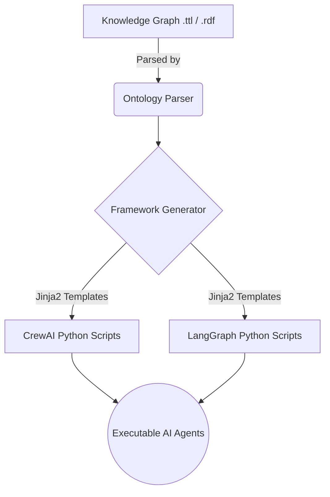

# Metode Rekayasa Perangkat Lunak KOMB - Ilmu Komputer UGM 2026

Kelompok 8:

1. Rayhan Haldi Hermawan           (24/545406/PA/23176) - Project Manager / Lead Developer
2. Pratama Nanindra Aji            (24/533677/PA/22604) - AI Engineer / Architect
3. Muhammad Rayyan Buna Satria     (24/543564/PA/23096) - Backend Developer
4. Kevin Febriano                  (24/541948/PA/23002) - QA / Documentation Specialist

# Agentic AI Framework Generator

## Description

This project is a tool/pipeline that automatically generates Agentic AI framework code from Knowledge Graphs (KGs) of Agentic AI patterns. The system reads KGs constructed using the [Agentic AI Ontology](https://w3id.org/agentic-ai/onto) and transforms them into executable code for target frameworks such as CrewAI and AutoGen.

### Project Overview

The generator bridges the gap between abstract agentic AI patterns defined in ontologies and concrete implementations in popular agentic AI frameworks. By parsing Knowledge Graphs that describe agentic AI patterns, the tool can automatically produce runnable code that implements these patterns in different target frameworks.

#### System Architecture


### Key Features

- **Ontology-based Generation**: Uses the standard Agentic AI Ontology (https://w3id.org/agentic-ai/onto) as the foundation
- **Multi-framework Support**: Generates code for multiple agentic AI frameworks:
  - CrewAI
  - AutoGen
- **Knowledge Graph Parsing**: Reads and interprets KGs in RDF/Turtle format (.ttl, .rdf)
- **Pattern Recognition**: Extracts agentic AI patterns including agents, tasks, tools, and workflows
- **Automated Code Generation**: Produces executable Python scripts for target frameworks

## Installation

1. Clone the repository:
   ```bash
   git clone https://github.com/nauraranantya/agentic-generator.git
   cd agentic-generator
   ```
2. Create and activate a virtual environment:

```bash
python -m venv venv
source venv/bin/activate       # macOS/Linux
venv\Scripts\activate          # Windows
```

3. Install dependencies:

```bash
```bash
pip install -r requirements.txt
```

## Environment Variables & Configuration

The application uses a `.env` file to manage configuration variables. Ensure you create a `.env` file in the root directory (you can copy `.env.example`).

| Variable Name | Description | Default / Example |
|---|---|---|
| `GEMINI_API_KEY` | API Key for accessing Gemini Models (used by default LangGraph generator) | `your_gemini_api_key` |
| `OPENAI_API_KEY` | API Key for accessing OpenAI Models (used by default CrewAI generator) | `your_openai_api_key` |
| `OPENAI_MODEL_NAME` | The default LLM model name to invoke in the scripts | `gemini/gemini-3.1-flash-lite` |


## Usage

### Option 1: Generate Multi-Agent Code from Knowledge Graph

1. Place the Knowledge Graph (in .ttl or .rdf format) inside the data/ folder, or use the existing dummy data in `data/` or `kg_g3/`.
   Example: `data/dummy_kg.ttl`

2. Run the automated pipeline:

   ```bash
   python runner.py
   ```

   This will automatically:
   - Parse the knowledge graph ontology
   - Generate CrewAI framework code
   - Generate AutoGen framework code

3. Check the `output/` folder for generated scripts:
   - `crewai_generated.py`
   - `autogen_generated.py`

### Option 2: Test Workflow Simulation (Demo)

1. Place your gpt-4o-mini API key in a `.env` file in the root directory:

   ```
   OPENAI_API_KEY=your-api-key-here
   ```

2. Run the pre-configured workflow test:

   ```bash
   python test_email_workflow.py
   ```

   This demonstrates a complete email auto-responder workflow using CrewAI with:
   - Email classification
   - Automated response generation
   - Quality review process

   OR

   ```bash
   python test_cust_support_workflow.py
   ```

   This demonstrates a customer support ticket handling workflow using AutoGen with:
   - Ticket classification and prioritization
   - Multi-agent collaboration for resolution
   - Automated response generation

3. View the complete workflow execution and results in the console output.

### Option 3: Run Docker

1. Install docker in your computer

2. Build the image:

   ```
   docker compose build
   ```

3. Run the application via Docker:

   ```
   docker compose up agento
   ```
   *Note: Because this is a CLI pipeline application, no external port mappings are required in `docker-compose.yml`. All processes run natively within the container and output code artifacts to the bound `/app/output_files` volume.*

4. Go to development mode:

   ```
   docker compose run --rm agento-dev
   ```

5. Stop containers:

   ``` 
   docker compose down
   ```

## Detailed Use Cases

Below are 3 documented use cases of patterns processed by this pipeline:

### Use Case 1: Chat Agent (LangGraph)
- **Description:** A simple conversational LLM node that processes user input messages and replies using the Google Gemini model. It maintains conversation state sequentially.
- **Input:** A string message from the user (e.g., `Hello, what can you do?`).
- **Output:** The raw text response from the language model acting as a helpful assistant (e.g., `I am a helpful AI assistant. I can answer questions and write code!`).

### Use Case 2: Recruitment Crew (CrewAI)
- **Description:** A multi-agent sequential pipeline consisting of a Researcher, Matcher, Communicator, and Reporter. It evaluates job candidates against job requirements.
- **Input:** A set of Job Requirements and a description of the desired candidate (e.g., `Looking for a Senior React Engineer with 5 years of experience...`).
- **Output:** A detailed Markdown report presenting the best candidates, their suitability scores, and a draft outreach email strategy.

### Use Case 3: Pizza Orderer (LangGraph)
- **Description:** A conditional routing graph that locates a nearby pizza store before processing an order transaction.
- **Input:** A natural language request to order pizza (e.g., `I want to order a large pepperoni pizza to 123 Main St.`).
- **Output:** Execution traces of the agent finding the store (`Executing task: findStore`) followed by processing the order (`Executing task: orderPizza`) and returning a success message.

